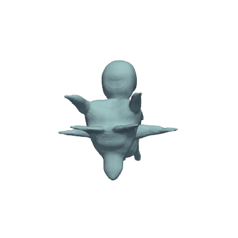

3D Game Asset Generation API

This project provides a backend service for rapidly prototyping 3D game assets from text prompts. It uses OpenAI's Shap-E model, exposed through a high-performance, asynchronous FastAPI application. The service is designed to take a simple text prompt and return a game-ready 3D model, bridging the gap between creative ideas and tangible assets.

The entire application is packaged as a single Python script (3D_Model.py), designed for easy setup and execution in a cloud environment like Google Colab.
Table of Contents

    Key Features

    Sample Output

    Demonstration Setup

        Prerequisites

        Execution Steps

    API Reference

        Endpoints

        Example Workflow

    Project Structure

Key Features

    Text-to-3D Generation: Leverages the Shap-E model to create 3D meshes from natural language descriptions.

    Asynchronous Architecture: The API is built asynchronously to handle long-running model inference (1-3 minutes) without blocking or causing timeouts.

    Standardized Outputs: The service generates both a .glb file, the modern standard for 3D web and game assets, and a rotating .gif for immediate visual previewing.

    Cloud-Ready Execution: Designed to be run effortlessly in Google Colab, leveraging free GPU resources to accelerate model performance.

Sample Output

The following asset was generated using the API.
Prompt: a cute magical fox
Animated GIF Preview	3D Model (.glb)

	Download .glb File
Demonstration Setup

The project is designed to be executed in Google Colab by cloning this repository.
Prerequisites

    A Google Account (for Colab).

    A free Ngrok account to create a public URL tunnel to the API.

Execution Steps

    Open a New Colab Notebook: Go to colab.research.google.com and create a new notebook.

    Set Runtime Type: In the top menu, navigate to Runtime -> Change runtime type and select T4 GPU from the dropdown. This is required for model inference.

    Clone the Repository & Install Dependencies: Add a new code cell and paste the following commands to clone this repository and install the required Python packages. Replace <your-github-repo-url> with the URL of this repository.
    Generated bash

          
    # Clone the project repository from GitHub
    !git clone <your-github-repo-url>

    # Navigate into the project directory
    # (replace '3D-Game-Asset-Generation-API' if your repo folder has a different name)
    %cd 3D-Game-Asset-Generation-API 

    # Install all necessary dependencies
    !pip install -r requirements.txt

        

    IGNORE_WHEN_COPYING_START

Use code with caution. Bash
IGNORE_WHEN_COPYING_END

Set Your Ngrok Token:

    Log in to your ngrok dashboard and copy your authentication token.

    In a new code cell, paste the following code and replace "YOUR_NGROK_AUTHTOKEN_HERE" with your actual token. The Python script will read this environment variable.

Generated python

      
import os
os.environ['NGROK_AUTH_TOKEN'] = "YOUR_NGROK_AUTHTOKEN_HERE"

    

IGNORE_WHEN_COPYING_START
Use code with caution. Python
IGNORE_WHEN_COPYING_END

Run the Server: In a final code cell, run the main Python script. This will download the Shap-E model, start the FastAPI server, and print a public ngrok URL that you can use to access the API.
Generated bash

      
!python 3D_Model.py

    

IGNORE_WHEN_COPYING_START

    Use code with caution. Bash
    IGNORE_WHEN_COPYING_END

    Once running, you will see output indicating the server has started, followed by your public URL.

API Reference

The server exposes a RESTful API to generate and retrieve 3D models.
Endpoints
GET /status

    Description: Checks the health and status of the API and the loaded model.

    Success Response (200 OK):
    Generated json

          
    {
      "status": "online",
      "model_version": "openai/shap-e",
      "uptime_seconds": 358.98,
      "device": "cuda"
    }

        

    IGNORE_WHEN_COPYING_START

    Use code with caution. Json
    IGNORE_WHEN_COPYING_END

POST /generate3d

    Description: Submits a new job to generate a 3D model. This is a non-blocking, asynchronous call.

    Query Parameter: prompt (string, required).

    Success Response (202 Accepted):
    Generated json

          
    {
      "message": "3D model generation job has been queued.",
      "job_id": "012d768d-8745-4a2e-aeb4-44457e8bffe3",
      "status_url": "/job/012d768d-8745-4a2e-aeb4-44457e8bffe3"
    }

        

    IGNORE_WHEN_COPYING_START

    Use code with caution. Json
    IGNORE_WHEN_COPYING_END

GET /job/{job_id}

    Description: Polls for the status of a specific generation job.

    Path Parameter: job_id (string, required).

    Success Response (200 OK) - Completed:
    Generated json

          
    {
      "id": "012d768d-8745-4a2e-aeb4-44457e8bffe3",
      "prompt": "a cute magical fox",
      "status": "completed",
      "result": {
        "glb_url": "/assets/012d768d-8745-4a2e-aeb4-44457e8bffe3.glb",
        "gif_url": "/assets/012d768d-8745-4a2e-aeb4-44457e8bffe3.gif"
      }
    }

        

    IGNORE_WHEN_COPYING_START

    Use code with caution. Json
    IGNORE_WHEN_COPYING_END

Example Workflow

You can use a tool like curl to interact with the live API.
Generated bash

      
# 1. Start a generation job for "a sci-fi space helmet"
curl -X POST "https://<your-ngrok-url>/generate3d?prompt=a%20sci-fi%20space%20helmet"

# Note the job_id from the response.

# 2. Check the job status after ~90 seconds
curl -X GET "https://<your-ngrok-url>/job/<your-job-id>"

# 3. Once complete, view the GIF preview in a browser
# e.g., https://<your-ngrok-url>/assets/<your-job-id>.gif

    

IGNORE_WHEN_COPYING_START
Use code with caution. Bash
IGNORE_WHEN_COPYING_END
Project Structure
Generated code

      
.
├── 3D_Model.py       # The main Python script containing the entire backend application.
├── requirements.txt  # Python dependencies for easy installation.
├── generated_assets/ # Directory for sample outputs.
│   ├── sample_cute_magical_fox.gif
│   └── sample_cute_magical_fox.glb
├── .gitignore        # Specifies files and directories to be ignored by Git.
└── README.md         # This project documentation file
